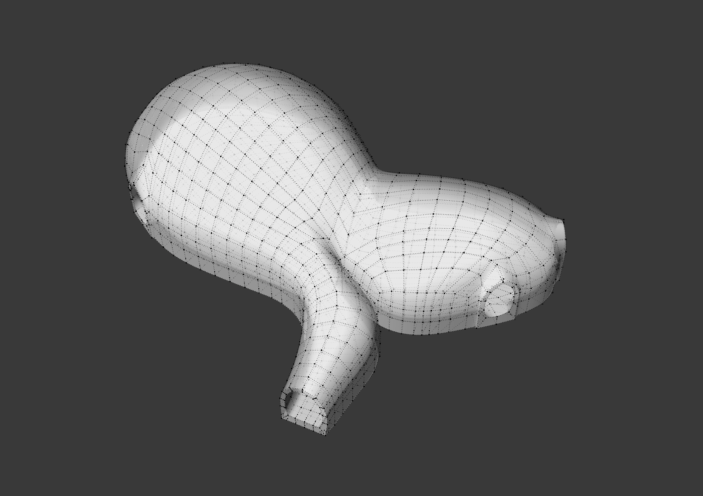
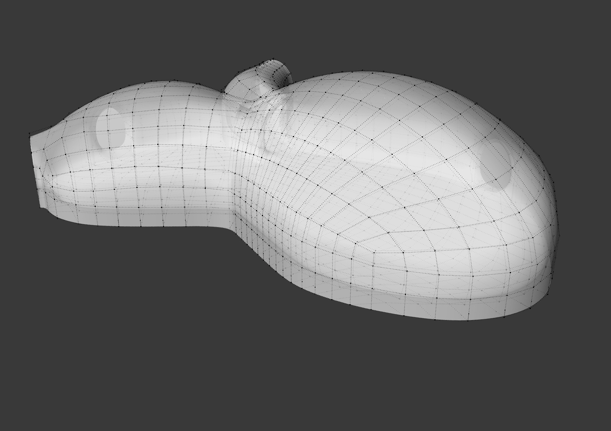
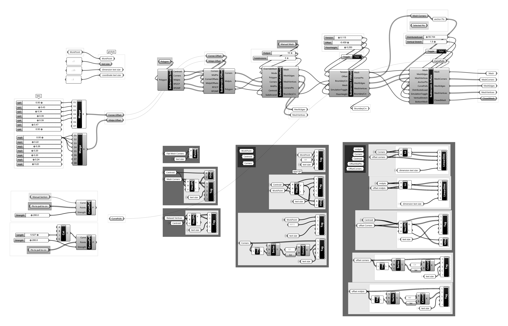
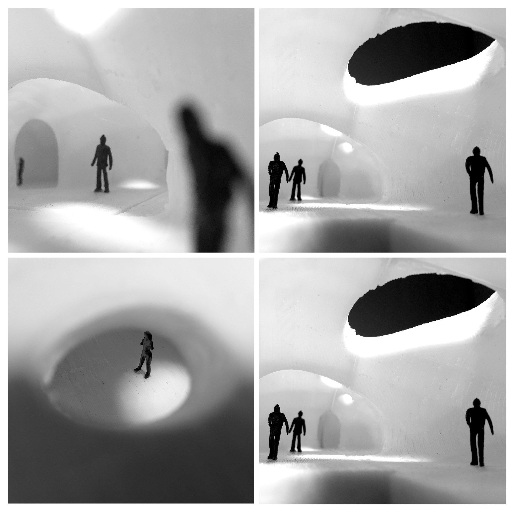
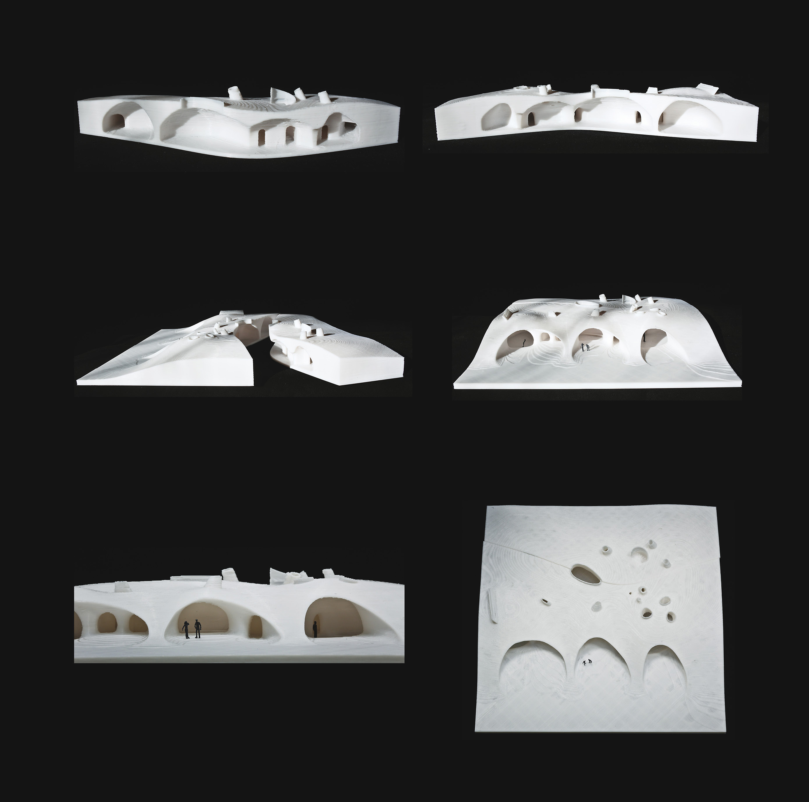

# Subterrain

Custom tooling and methodology for exploring structurally performant water tight shell geometries inside polygonal planar cell boundaries and under distributed vertical load using Grasshopper + Kangaroo.

## Demo

 



## Getting Started

### Dependancies

Grasshopper definitions and python scrips requires the following rhino/gh plugins to work:

```
Tsplines
Kangaroo
Weaverbird
GhPython
```

### How to use tool

Open sandbox.3dm, launch grasshopper and open sandbox.gh. Should have something like this:



## Roadmap

Would like to develop this into fully integrated system for subterrainian architecture, that allows users to manipulate user/building constraints in real-time and outputs closed mesh massing for rapid prototyping, and perhaps generates complete set of shop drawings for fabrication :). If you are interested in helping please let me know.

## Contributors

**Joshua Parker** - [PurpleBooth](https://github.com/PurpleBooth)

See full list of [contributors](https://github.com/your/project/contributors) who participated in this project. *Currently no contributors*

## Acknowledgments

Definitions and scripts developed in the context of a project with [OPEN Architecture](www.openarch.com), currently under construction. Images copyright (c) 2016 OPEN Architecture.

 


## Reference

* Adriaenssens, S., Block, P., Veenendaal, D., & Williams, C. (2014). Shell structures for architecture: Form finding and optimization.